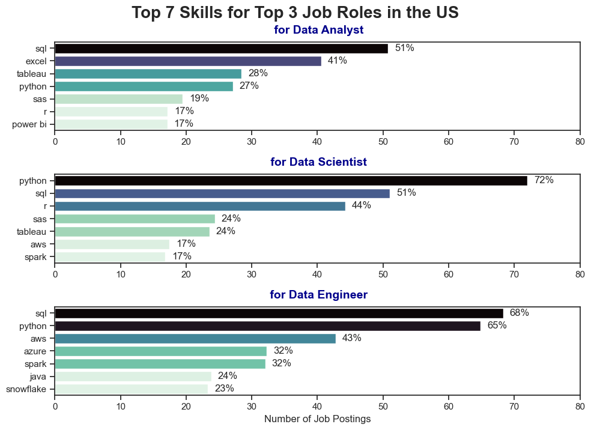
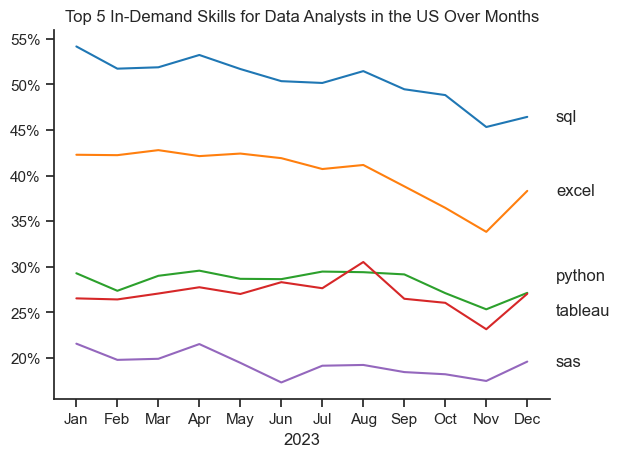
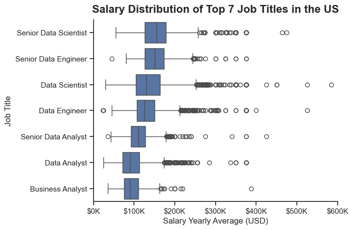

# Overview
This project analyzes the data job market with a focus on Data Analyst roles, with the goal of identifying high-demand and high-paying skills that lead to better job opportunities.

The dataset is sourced from Luke Barousse’s Python course, containing job posting information such as job titles, salaries, locations, and required skills. Using Python-based analysis and visualization, the project investigates skill demand patterns, salary trends, and the best skill combinations for Data Analysts who want to maximize career growth.

# The Questions
The analysis aims to answer the following key questions:
1. What are the most in-demand job titles in data analytics?
2. Which countries show the highest demand for Data Analytics jobs?
3. What skills are most in demand for the top three most popular data roles?    
4. How do in-demand skills trend over time for Data Analysts?
5. How well do Data Analyst roles and associated skills pay?
6. Which skills are the most optimal for Data Analysts to learn? (high-demand + high-paying)
# Tools I Used
This analysis was conducted using the following tools:

- Python — used for data preparation, exploration, and analysis

        - Pandas — data manipulation and aggregation

        - Matplotlib — core visualization 

        - Seaborn — advanced statistical charts
- Jupyter Notebooks — interactive analysis, documentation, and experimentation

- Visual Studio Code — running scripts and project development

- Git & GitHub — version control, project tracking, and publishing results


# Data Preparation and Cleanup

To ensure accuracy and usability, the dataset underwent preprocessing steps including date conversion and skill parsing.

## Importing Libraries and Data

```python
# Importing necessary libraries
import ast
import pandas as pd
import seaborn as sns
from datasets import load_dataset
import matplotlib.pyplot as plt 

# Loading Data
dataset = load_dataset('lukebarousse/data_jobs')
df = dataset['train'].to_pandas()

#data cleanup
df['job_posted_date'] = pd.to_datetime(df['job_posted_date'])
df['job_skills'] = df['job_skills'].apply(lambda x : ast.literal_eval(x) if pd.notna(x) else x)
```
View my notebook with detailed steps here:[ "Importing and Cleanup"](<Part/Importing and Cleanup.ipynb>)


## Filtering for U.S.-Based Jobs
To narrow the analysis to a consistent job market, this project focuses on job postings located in the United States:

```python
df_US_DA = df[(df['job_country'] == 'United States') & (df['job_title_short'] == 'Data Analyst')].copy()
```
# The Analysis
Each Jupyter notebook in this project focuses on analyzing a specific aspect of the data job market. Below is the approach used to address each question:

## 1: What are the most in-demand job titles in data analytics ?

To identify the most in-demand roles in data analytics, I analyzed job postings to determine which job titles appear most frequently. By focusing on these popular roles, this analysis highlights where market demand is strongest and helps clarify which data analytics positions offer the best career opportunities.
View my notebook with detailed steps here: ["Exploratory".](Part/Exploratory.ipynb)

### Visualize Data
```python
df_plot = df['job_title_short'].value_counts().to_frame()

sns.set_theme(style = 'ticks')              #defining the theme
sns.barplot(data = df_plot,                 #plotting the barplot
            x = 'count',                    #x-axis
            y = 'job_title_short',          #y-axis
            hue = 'count',                 
            palette = 'dark:b_r',           #color palette
            legend=False                    #removing the legend
            )

plt.title('Number of Job Postings by Job Title')
plt.xlabel('Number of Job Postings')
plt.ylabel('')

plt.show()
```
### Results:

*bar chart showing number of job postings by job title*

### Insight:
The job market shows strongest demand for Data Analysts, followed by Data Engineers and Data Scientists, while senior and highly specialized roles appear less frequently, indicating broader opportunities at entry and mid-career levels.sitions requiring advanced or specialized expertise.

## 2. Which countries show the highest demand for Data Analytics jobs ?
To determine which countries have the highest demand for data analytics, I analyzed job postings by location and compared the number of available roles across countries. This highlights the regions where data analytics professionals are most sought after and where job opportunities are most concentrated.

View my notebook with detailed steps here: ["Exploratory".](Part/Exploratory.ipynb)
### Visualize Data
```python
df_plot_countries = df['job_country'].value_counts().head(19).to_frame()

sns.set_theme(style='ticks')
sns.barplot(data = df_plot_countries,
            x = 'count',
            y = 'job_country',
            hue = 'count',
            palette='viridis_r'
            
            )

plt.title('Number of Job Postings by Country (Top 19)')
plt.xlabel('Number of Job Postings')
plt.ylabel('')
plt.show()
```
### Results:

*bar chart showing number of job postings by country (top 19)*
### Insight:
The United States shows the highest demand for data analytics roles by a significant margin, far exceeding other countries. India and the United Kingdom follow, indicating strong global demand, while European countries such as France and Germany show moderate but consistent opportunities.

## 3. What skills are most in demand for the top three most popular data roles ?
To identify the most in-demand skills for the top three most popular data roles, I first determined the roles with the highest number of job postings. I then analyzed the required skills associated with these roles and ranked them by frequency. This approach highlights the core technical skills employers value most for each role, helping guide skill development based on the targeted position.

View my notebook with detailed steps here: ["Skills"](skills.ipynb).

### Visualize Data
```python
# Plot Skill Counts
fig , ax = plt.subplots(3, 1, figsize = (10,7))  

# Plotting bar plots for top 3 roles
for i, job_t in enumerate(top3_roles):
    sns.set_theme(style='ticks')
    df_US_exploded_gr_plot = df_US_exploded_gr[df_US_exploded_gr['job_title_short'] == job_t].head(7)  # 7 top skills
    sns.barplot(data = df_US_exploded_gr_plot,
                x = 'skill_count',
                y = 'job_skills',
                ax = ax[i],
                hue = 'skill_count',   
                palette = 'mako_r',
                legend=False
                )
    ax[i].set_title(f' for {job_t}',           #setting title
                     fontsize=14,
                     pad = 10,                 #spacing between title and plot
                     fontweight="bold",        #bold font
                     color="darkblue",
                     loc="center",
                     ) 
    
    ax[i].set_xlabel('')

    if i == 2:
      ax[i].set_xlabel('Number of Job Postings') # Adding xlabel only to the last plot

    ax[i].set_ylabel('')
    ax[i].set_xlim(0, 45000) 

plt.tight_layout()
plt.suptitle('Top 7 Skills for Top 3 Job Roles in the US', y=1.02, fontsize=20, fontweight="bold")
plt.show()
```
### Results:

*bar charts showing top 7 skills for top 3 job roles in the US*

### Insight:
The most in-demand skills vary by role but show strong overlap across positions. SQL and Python are consistently the most requested skills for Data Analysts, Data Scientists, and Data Engineers. Data Analyst roles emphasize tools like Excel and Tableau, Data Scientist roles focus more on Python, R, and statistical tools, while Data Engineer roles prioritize cloud platforms and big data technologies such as AWS, Azure, and Spark.

## 4. How do in-demand skills trend over time for Data Analysts ?
The analysis shows that core skills such as SQL and Excel maintain consistently high demand throughout the year, highlighting their importance as foundational tools for Data Analysts. Python and data visualization tools like Tableau show stable demand with moderate fluctuations, while some skills experience seasonal variation. Overall, the trends indicate that while demand shifts slightly over time, a strong set of core technical skills remains essential in the Data Analyst job market.

View my notebook with detailed steps here: ["Trend"](Part/Trend.ipynb)

### Visualize Data
```python
from matplotlib.ticker import PercentFormatter

sns.set_theme(style='ticks')
sns.lineplot(data=df_US_DA_skills_pivot_prcnt.iloc[:,:5],     
             dashes = False,                                  #removing dashes
             legend=False,
             palette='tab10',                                 #color palette
              )
sns.despine()

plt.title('Top 5 In-Demand Skills for Data Analysts in the US Over Months')
plt.xlabel('2023')
plt.ylabel('')

# Formatting y-axis as percentage
plt.gca().yaxis.set_major_formatter(PercentFormatter(decimals=0))                   


offsets = {"python": 2, "tableau": -2.}  # ajuste si besoin

for i in range(5):
    skill = df_US_DA_skills_pivot_prcnt.columns[i]
    y = df_US_DA_skills_pivot_prcnt.iloc[-1, i] + offsets.get(skill, 0)   #ajustement

    plt.text(11.7, y, skill, va="center")                                 #ajout des labels de fin de ligne


plt.show()
```
### Results:


*line chart showing top 5 in-demand skills for Data Analysts in the US over months*

### Insight:
SQL remains the most consistently in-demand skill throughout the year, despite a slight decline toward the end. Excel follows a similar pattern with moderate seasonal fluctuation, while Python and Tableau maintain steady demand. SAS remains the least requested among the top skills, showing relatively stable but lower demand overall.

## 5. How well do Data Analyst roles and associated skills pay ?
The analysis shows that Data Analyst roles offer competitive salaries, with compensation increasing alongside specialization and technical expertise. While foundational skills such as SQL and Excel are widely required and provide solid earning potential, higher salaries are often associated with more advanced or specialized skills like Python, Tableau, and database technologies. Overall, combining core analytical skills with high-value technical tools leads to stronger salary outcomes in the Data Analyst job market.

View my notebook with detailed steps here: ["Salary"](salary.ipynb).

### Visualize Data
```python
sns.set_style('ticks')
sns.boxplot(data = df_US_top7,
            y ='job_title_short',
            x = 'salary_year_avg',
            order = top7_jobs_order                        #ordering job titles by median salary
            )
sns.despine()
plt.title('Salary Distribution of Top 7 Job Titles in the US',
          fontsize=16, 
          fontweight="bold", 
          pad=10)
plt.xlabel('Salary Yearly Average (USD)')
plt.ylabel('Job Title')
plt.xlim(0, 600000)
plt.gca().xaxis.set_major_formatter(plt.FuncFormatter(lambda x, loc: f"${int(x/1000)}K"))        #formatting x-axis in K USD

plt.show()
```
### Results:


*box plot showing salary distribution of top 7 job titles in the US*

### Insight:
Salaries in the data job market increase clearly with seniority and technical specialization. Senior Data Scientist and Senior Data Engineer roles command the highest median salaries and show wide salary ranges, reflecting strong earning potential and variability at higher levels. In contrast, Data Analyst and Business Analyst roles tend to offer more stable but lower salary distributions, making them more consistent entry and mid-level positions compared to highly technical data roles.

## Investigate Median Salary Vs Skill for Data Analysts

This analysis explores how individual skills impact the median salary of Data Analyst roles in the United States. By examining both the frequency with which skills appear in job postings and the median salary associated with each skill, this section highlights which skills are most valuable in terms of compensation and how skill specialization influences earning potential.

View my notebook with detailed steps here: ["Salary"](salary.ipynb).

### Visualize Data
```python
fig , ax = plt.subplots(2, 1)

fig.set_size_inches(9, 5)                 #setting figure size
sns.set_theme(style='ticks')
sns.barplot(data = df_top_skills_paid,
            x = 'median',
            y = 'job_skills',
            ax = ax[0],
            hue='median',
            palette='dark:b_r',
            legend=False
            )

ax[0].set_title('Top 7 Highest Paying Skills for Data Analysts in the US',
                fontsize=14,
                pad = 10,                 
                fontweight="bold",)
ax[0].set_xlabel('')
ax[0].set_ylabel('')
ax[0].xaxis.set_major_formatter(plt.FuncFormatter(lambda x, loc: f"${int(x/1000)}K"))

sns.barplot(data = df_top_skills_demand,
            x = 'median',
            y = 'job_skills',
            ax = ax[1],
            hue='median',
            palette='dark:b_r',
            legend=False
            )
ax[1].set_title('Top 7 In-Demand Skills for Data Analysts in the US',
                fontsize=14,
                pad = 10,                 
                fontweight="bold",)   
ax[1].set_xlabel('Median Salary Yearly Average (USD)')
ax[1].set_ylabel('')
ax[1].xaxis.set_major_formatter(plt.FuncFormatter(lambda x, loc: f"${int(x/1000)}K"))
ax[1].set_xlim(ax[0].get_xlim())

sns.despine()            #removing top and right spines

plt.tight_layout()        #adjusting subplots to fit in figure area.

plt.show()
```
### Results:


*bar charts showing top 7 highest paying skills and top 7 in-demand skills for Data Analysts in the US*

### Insight:
The comparison between highest-paying and most in-demand skills for Data Analysts reveals a clear distinction between salary potential and market demand. Specialized and less common skills such as dplyr, GitLab, and Bitbucket are associated with significantly higher median salaries, indicating strong financial rewards for niche expertise. In contrast, widely requested skills like SQL, Excel, and Python appear in a much larger number of job postings but offer more moderate median salaries. This highlights the importance of combining foundational skills with specialized tools to maximize both employability and earning potential in data analytics.


